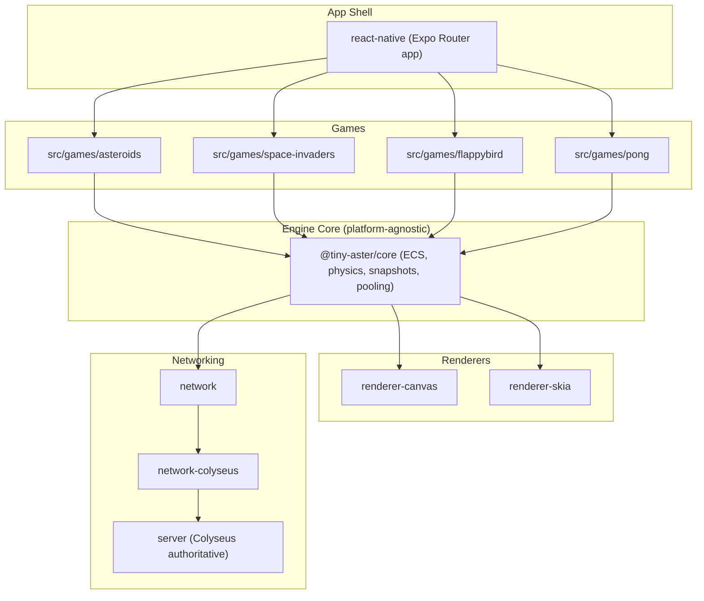

# 🕹️ Tiny Aster — A Deterministic ECS Arcade Engine

> A cross-platform, deterministic Entity-Component-System engine powering a retro arcade suite (Asteroids, Space Invaders, Flappy Bird, Pong) with dual rendering (Canvas & Skia) and authoritative multiplayer netcode.

[]()
[]()
[]()

---

## Why this project exists

Most React Native game demos hardcode gameplay logic directly into UI components. **Tiny Aster** takes the opposite approach: game logic lives in a **platform-agnostic ECS core** (`@tiny-aster/core`), completely decoupled from React Native, Expo, and the renderer. Presentation (Canvas/Skia) and multiplayer (Colyseus) are plugged in as swappable adapters, enforced by an automated boundary check (`scripts/check-core-boundaries.sh`) that forbids the core from importing React Native, Expo, Skia, Colyseus, or game-specific code.

This makes the engine:

- **Deterministic** — gameplay-affecting randomness is isolated to `world.gameplayRandom`, enabling reproducible simulations, replay, and rollback netcode.
- **Portable** — the same core drives 4 different games and can render to `<canvas>` or Skia without touching gameplay code.
- **Testable in isolation** — the core has no dependency on a rendering surface or platform, so systems, physics, and pooling can be unit-tested headlessly.

---

## 🏗️ Architecture



### Monorepo layout

| Package                     | Responsibility                                                                                |
| --------------------------- | --------------------------------------------------------------------------------------------- |
| `packages/core`             | ECS runtime, physics, systems, snapshots/rollback, component pooling, input, audio, event bus |
| `packages/renderer-canvas`  | Web/Canvas rendering adapter, shape drawers, background effects                               |
| `packages/renderer-skia`    | React Native Skia rendering adapter                                                           |
| `packages/network`          | Networking abstractions shared across transports                                              |
| `packages/network-colyseus` | Colyseus client integration for authoritative multiplayer                                     |
| `packages/react-native`     | React Native-specific bindings/UI glue                                                        |
| `src/games/*`               | Game-specific rules, entities, and content built on top of `@tiny-aster/core`                 |
| `server/`                   | Colyseus authoritative game server                                                            |

Architectural boundaries are not just documented — they're **enforced in CI** via `pnpm check:core-boundaries`, which fails the build if the core imports platform code or game-specific modules. For a deep dive into the monorepo architecture, ECS runtime, netcode, and onboarding guide, consult [`docs/ARCHITECTURE_AND_DEVELOPER_GUIDE.md`](./docs/ARCHITECTURE_AND_DEVELOPER_GUIDE.md).

---

## ✨ Engine Features

- **Deterministic ECS runtime** with typed components, systems, and a `BaseGame` lifecycle abstraction shared by every game.
- **Snapshot/restore & rollback** support for authoritative-server netcode reconciliation.
- **Component & prefab pooling** (`ComponentSetPool`, `PrefabPool`) with dev-mode detection of double-release and partial-destruction bugs — the kind of engine hygiene most hobby ECS implementations skip.
- **TTL system** for automatic entity lifecycle management.
- **Dual renderer strategy**: pluggable `CanvasRenderer` / Skia renderer, each implementing a common shape-drawer registration contract (`registerShape`, `registerBackgroundEffect`).
- **Design-driven development**: gameplay loops, economy balance, and juice/feel systems are specified up front in [`GDD.md`](./GDD.md) before implementation — including moment-to-moment, session, and meta-progression loops per game.
- **Integrated Audio System**: Low-latency browser audio playback via `WebAudioPlayer` (HTML5 `AudioContext` and `HTMLAudioElement` for SFX caching and BGM streaming), with a decoupled `PlaySFX` global event listener on `BaseGame`.

### 🔊 Audio System

The engine features a platform-agnostic audio system designed for a decouple-first architecture:

1. **`IAudioPlayer` Contract**: `BaseGame` abstracts all audio operations behind `IAudioPlayer` (with `NullAudioPlayer` serving as a headless/testing/server fallback).
2. **`WebAudioPlayer`**: High-performance browser implementation leveraging the Web Audio API (`AudioContext`) for low-latency SFX playback with spatial panning/attenuation and `HTMLAudioElement` for looping background music.
   - _Graceful Fallback_: Includes a mechanism that caches a silent dummy buffer if loading/decoding fails, avoiding potential errors on subsequent play calls.
3. **Decoupled Event-Driven Sound Triggering**: ECS systems do not need to call the audio player directly. Instead, they simply emit a `"PlaySFX"` event to the central `EventBus`:
   ```typescript
   eventBus.emit("PlaySFX" as any, { name: "hit" });
   ```
   A global listener registered in `BaseGame` intercepts these events and plays them on the configured audio player automatically.
4. **Dependency Injection**: Game instances can accept any custom player via the constructor's `BaseGameConfig`, falling back to `WebAudioPlayer` on client platforms:
   ```typescript
   const game = new PongGame({ audio: new WebAudioPlayer() });
   ```

## 🎮 Games included

| Game               | Highlights                                                               |
| ------------------ | ------------------------------------------------------------------------ |
| **Asteroids**      | Physics-driven movement, wraparound space, procedural asteroid splitting |
| **Space Invaders** | Wave scaling, shields, combo multipliers, kamikaze dive patterns         |
| **Flappy Bird**    | Animated background effects, pipe generation, precision collision        |
| **Pong**           | Paddle physics, authoritative multiplayer via Colyseus                   |

---

## 🚀 Quick Start

### Prerequisites

- Node.js ≥ 20
- pnpm 10.x
- Expo Go (for mobile device testing)

### Installation

```bash
# Install all workspace dependencies
pnpm install

# Start the client (Expo, builds core first via Turborepo)
pnpm start

# Start the authoritative server (Colyseus)
cd server
pnpm install
pnpm run dev
```

### Platform-specific dev builds

```bash
pnpm android   # Android via Expo
pnpm ios       # iOS via Expo
pnpm web       # Web via react-native-web
```

---

## ⚡ Turborepo & Monorepo Optimization

The repository utilizes **Turborepo** with **pnpm workspaces** for fast, deterministic, cache-aware builds and tests.

### Configuration & Caching Metrics

- **Pipeline Tasks (`turbo.json`)**:
  - `build`: Captures build artifacts across workspaces (`dist/**`, `build/**`) based on `src/**`, `package.json`, and `tsconfig.json`.
  - `typecheck`: Cache-aware typechecking dependent on `^build`.
  - `lint`: Cached linting step scoped to workspace sources.
  - `test`: Executes tests across dependent packages.
- **Measured Benchmark Impact**:
  - **Cold Build**: ~33s (compiling `@tiny-aster/core`, renderers, network transports, and server).
  - **Warm Build (`FULL TURBO`)**: **~200ms** (100% cache hit across all 7 workspace packages).

### Cache Maintenance & Full Clean

To purge build artifacts, Turborepo caches, and platform watchman/metro caches:

```bash
pnpm clean:full   # Purges .turbo/, node_modules/.cache, dist/, temp/, metro/watchman caches
```

### Architectural Evaluation: Modularizing Games into Subpackages

To further optimize CI times as the game suite expands, individual games under `src/games/*` can be refactored into distinct packages under `packages/games-*`:

- **`packages/games-asteroids`** (`@tiny-aster/games-asteroids`)
- **`packages/games-space-invaders`** (`@tiny-aster/games-space-invaders`)
- **`packages/games-geometry-wars`** (`@tiny-aster/games-geometry-wars`)
- **`packages/games-pong`** (`@tiny-aster/games-pong`)
- **`packages/games-flappy-bird`** (`@tiny-aster/games-flappy-bird`)
- **`packages/games-shared`** (`@tiny-aster/games-shared`)

**Benefits**:

1. **Granular Package Caching**: Changes to `asteroids` will not invalidate Turborepo build or test caches for `geometrywars` or `space-invaders`.
2. **Targeted Filtering**: Enables precise `pnpm --filter=@tiny-aster/games-asteroids test` invocations in CI pipelines.

---

## 🧪 Quality gates

Every change is expected to pass the same checks CI runs:

```bash
pnpm test                     # Run all test suites via Turborepo
pnpm lint                     # ESLint across the monorepo
pnpm story:lint               # Story graph & semantic validation linter
pnpm typecheck:core           # Strict typecheck of the engine core
pnpm typecheck:app            # Strict typecheck of the app layer
pnpm check:core-boundaries    # Enforce core/platform/game isolation
pnpm ci                       # Full CI pipeline locally: build core + boundaries + story:lint + docs:check + typecheck
```

The test suite spans multiple layers:

- **Unit tests** for ECS internals, pooling, snapshots (`packages/core/src/__tests__`)
- **Integration tests** for cross-system ECS behavior (`packages/core/tests`)
- **Per-game tests** for gameplay rules (`src/games/*/__tests__`)

---

## 🤝 Contributing

1. Read [`docs/ARCHITECTURE_AND_DEVELOPER_GUIDE.md`](./docs/ARCHITECTURE_AND_DEVELOPER_GUIDE.md) and [`GDD.md`](./GDD.md) before touching gameplay or core systems — architecture and mechanics are design-first.
2. Never import platform code (`react-native`, `expo-*`, `@shopify/react-native-skia`, `@colyseus`) or game-specific modules (`src/games`, `src/app`) inside `packages/core`. This is enforced automatically and will fail CI.
3. Add tests alongside new systems — prefer unit tests in `packages/core/src/__tests__` for engine logic and per-game tests for gameplay rules.
4. Run `pnpm ci` locally before opening a PR.

---

## 📜 License

MIT
